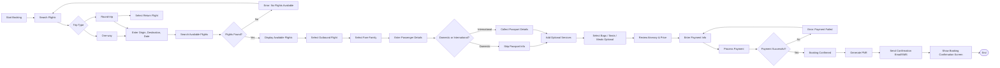

# Booking flow

```mermaid
flowchart LR

%% START
A[Start Booking] --> B[Search Flights]

%% SEARCH
B --> C{Trip Type}
C --> C1[One-way] --> D[Enter Origin, Destination, Date]
C --> C2[Round-trip] --> D

D --> E[Search Available Flights]
E --> F{Flights Found?}
F -- No --> Z1[Error: No Flights Available] --> B
F -- Yes --> G[Display Available Flights]

%% FARE SELECTION
G --> H[Select Outbound Flight]
C2 --> I[Select Return Flight]
H --> J[Select Fare Family]

%% PASSENGER INFO
J --> K[Enter Passenger Details]

%% DOMESTIC vs INTERNATIONAL
K --> L{Domestic or International?}
L -- Domestic --> M1[Skip Passport Info]
L -- International --> M2[Collect Passport Details]

M1 --> N[Add Optional Services]
M2 --> N

%% OPTIONALS
N --> O[Select Bags / Seats / Meals Optional]
O --> P[Review Itinerary & Price]

%% PAYMENT
P --> Q[Enter Payment Info]
Q --> R[Process Payment]
R --> S{Payment Successful?}
S -- No --> Z2[Error: Payment Failed] --> Q
S -- Yes --> T[Booking Confirmed]

%% CONFIRMATION
T --> U[Generate PNR]
U --> V[Send Confirmation Email/SMS]
V --> W[Show Booking Confirmation Screen]
W --> END([End])
```

