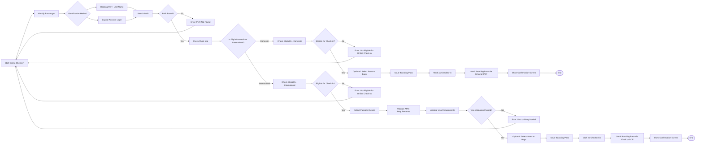

# Check-in Flow

```mermaid
flowchart LR

%% Start
A[Start Online Check-in] --> B[Identify Passenger]

%% Identification options
B --> C{Identification Method}
C --> C1[Booking Ref + Last Name]
C --> C2[Loyalty Account Login]
C1 --> D[Search PNR]
C2 --> D

%% PNR Check
D --> E{PNR Found?}
E -- No --> Z1[Error: PNR Not Found] --> A
E -- Yes --> F[Check Flight Info]

%% Determine Domestic vs International
F --> G{Is Flight Domestic or International?}
G -- Domestic --> H1[Check Eligibility - Domestic]
G -- International --> H2[Check Eligibility - International]

%% Domestic Eligibility
H1 --> I1{Eligible for Check-in?}
I1 -- No --> Z2[Error: Not Eligible for Online Check-in] --> A
I1 -- Yes --> J1[Optional: Select Seats or Bags] --> K1[Issue Boarding Pass]
K1 --> L1[Mark as Checked-in]
L1 --> M1[Send Boarding Pass via Email or PDF]
M1 --> N1[Show Confirmation Screen]
N1 --> END1([End])

%% International Eligibility
H2 --> I2{Eligible for Check-in?}
I2 -- No --> Z3[Error: Not Eligible for Online Check-in] --> A
I2 -- Yes --> J2[Collect Passport Details]
J2 --> K2[Validate APIS Requirements]
K2 --> L2[Validate Visa Requirements]

%% Visa Check
L2 --> M2{Visa Validation Passed?}
M2 -- No --> Z4[Error: Visa or Entry Denied] --> A
M2 -- Yes --> N2[Optional: Select Seats or Bags] --> O2[Issue Boarding Pass]
O2 --> P2[Mark as Checked-in]
P2 --> Q2[Send Boarding Pass via Email or PDF]
Q2 --> R2[Show Confirmation Screen]
R2 --> END2([End])
```
